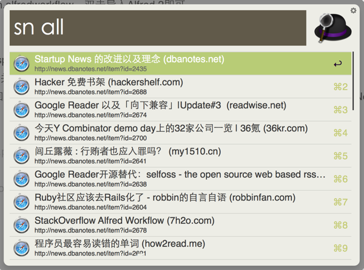
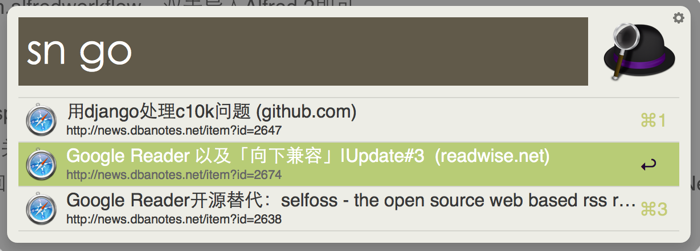

# SNSearch
Alfred是OS X最常用的一款增强型工具软件，充分利用了OS X的系统特性，帮助用户通过快捷键完成各种常用操作，属于Mac必备软件。近期Alfred发布了V2，对原有特性进行了增强和完善，并推出了全新的workflow功能，提供了极为简洁的接口和各种Action，帮助用户定制自己的功能。

SNSearch是为Alfred开发的一款workflow，主要功能是检索Startup News网站的最新推荐文章。  

[Startup News](http://news.dbanotes.net)由@Fenng创建，不了解的可以看[介绍和解释](http://dbanotes.net/startup_news.html)、[改进与理念](http://dbanotes.net/geek/startup_news_evolution.html)  
如果你是创业者，技术人，产品经理，VC…你可能需要这个小工具，跟踪业界动态。

# Development
Alfred 2的workflow提供了多种实现方式，比如shell、php、perl、python、ruby和applescript。
SNSearch是基于Python2.7和Shell构建的。

# Requirements
* Python2.7 （OS X 10.8默认的Python版本）
* Alfred 2（付费版）

# Installation
下载SNSearch.alfredworkflow，双击导入Alfred 2即可。

# How to use
* 通过option+space呼出Alfred，输入sn all，查看Startup News最近推荐的文章列表。
* 输入“sn 查询关键字”，可以按照标题内容进行检索，关键字大小写模糊匹配。
* 选中文章后回车可以直接用浏览器打开原生网址，按住command键回车可以查看Startup News的相关评论。

